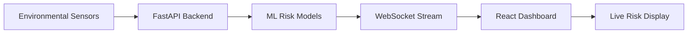

# Rockfall Detection and Prediction System

[](https://python.org)
[](https://react.dev)
[](https://ultralytics.com)
[](https://fastapi.tiangolo.com)
[](LICENSE)


## Key Features

### **AI-Powered Detection & Prediction**
- **YOLOv8 Object Detection**: Real-time rock detection in video streams (99.5% mAP50)
- **ML Risk Prediction**: XGBoost, Random Forest, and Neural Network ensemble for risk assessment
- **Real-time Analysis**: Advanced computer vision for instant threat detection

### **Live Monitoring System**
- **Multi-Camera Surveillance**: 4-directional camera feeds (East, West, North, South)
- **Real-time Streaming**: Live video feeds with WebRTC support
- **Camera Controls**: Record, pause, fullscreen viewing capabilities
- **Status Monitoring**: Real-time camera health and connectivity status

### **Digital Elevation Model (DEM) Analysis**
- **Terrain Visualization**: Color-coded elevation mapping with advanced rendering
- **Multi-Mine Support**: Pre-loaded data for Bingham Canyon, Chuquicamata, and Grasberg mines
- **Interactive Analysis**: Zoom, pan, and statistical analysis tools
- **Color Coding**: Green (low) → Yellow → Brown → White (high elevation)
- **Statistical Insights**: Elevation statistics, terrain analysis, and downloadable reports

### **Multi-Source Data Integration**
- Digital Elevation Models (.tif) processing with rasterio
- Environmental sensor monitoring
- Weather pattern analysis
- Terrain feature extraction and slope analysis

### **Smart Alert System**
- Real-time risk assessment
- Multi-level alert thresholds
- Automated notification system
- Historical event tracking

### **Modern Web Interface**
- **React Frontend**: Modern, responsive Material-UI design
- **FastAPI Backend**: High-performance async API server
- **Real-time Updates**: WebSocket-based live data streaming
- **Interactive Dashboards**: Live monitoring, risk visualization, and system analytics

## Project Architecture

### **Project Structure**
```
rockfall_detection/
├── frontend/               # React Web Application (Port: 3000)
│   ├── src/                    # React source code
│   │   ├── pages/                     # Page components
│   │   │   ├── Dashboard.jsx              # Main monitoring dashboard
│   │   │   ├── Detection.jsx              # Rock detection interface
│   │   │   ├── RiskAssessment.jsx         # Environmental risk forms
│   │   │   ├── LiveMonitoring.jsx         # 4-camera surveillance system
│   │   │   ├── DEMAnalysis.jsx            # Digital Elevation Model visualization
│   │   │   └── Settings.jsx               # System configuration
│   │   ├── hooks/                     # Custom React hooks
│   │   │   └── useWebSocket.js            # WebSocket connection hook
│   │   └── App.jsx                    # Main application component
│   ├── package.json            # Node.js dependencies (React 18, Material-UI)
│   └── vite.config.js         # Vite build configuration
│
├── backend/                # FastAPI Web Server (Port: 8000)
│   └── main.py                 # FastAPI application with ML integration
│       ├── Camera APIs                # /api/camera/* endpoints
│       ├── DEM Processing            # /api/dem/analyze/* endpoints
│       ├── Rock Detection           # /api/detect-rocks endpoint
│       ├── Risk Assessment         # /api/predict-risk endpoint
│       └── WebSocket Support       # Real-time data streaming
│
├── src/                    # Core ML & Analysis Modules
│   ├── prediction/         # ML prediction models
│   │   ├── ml_models.py           # XGBoost, RF, NN models
│   │   ├── train_models.py        # Model training script
│   │   ├── test_models.py         # Model testing & validation
│   │   ├── synthetic_data_generator.py  # Training data generation
│   │   ├── integrated_system.py   # Complete prediction pipeline
│   │   └── risk_assessment.py     # Risk calculation logic
│   │
│   ├── detection/          # Object detection (placeholder for future)
│   ├── dem_analysis/       # Digital Elevation Model processing
│   │   └── dem_processor.py       # DEM analysis & feature extraction
│   │
│   ├── sensors/            # Sensor data processing
│   │   └── sensor_alerts.py       # Sensor monitoring & alerts
│   │
│   ├── dashboard/          # Legacy dashboard interface
│   │   ├── app.py                 # Main dashboard application
│   │   └── enhanced_dashboard.py  # Advanced dashboard features
│   │
│   └── training/          # Model training utilities
│
├── data/                   # Training & input data
│   ├── DEM/                # Digital Elevation Models
│   │   ├── Bingham_Canyon_Mine.tif    # Utah copper mine DEM
│   │   ├── Chuquicamata_copper_Mine.tif # Chile copper mine DEM
│   │   └── Grasberg_Mine_Indonesia.tif # Indonesia gold mine DEM
│   │
│   └── rockfall_training_data/  # YOLOv8 training dataset
│       ├── train/images/          # Training images (905 samples)
│       ├── train/labels/          # YOLO format annotations
│       ├── valid/images/          # Validation images (48 samples)
│       ├── valid/labels/          # Validation annotations
│       ├── test/images/           # Test images (12 samples)
│       └── test/labels/           # Test annotations
│
├── outputs/               # Generated outputs & models
│   ├── models/             # Trained ML models
│   │   ├── xgboost_model.joblib      # XGBoost classifier
│   │   ├── random_forest_model.joblib # Random Forest classifier
│   │   ├── neural_network_model.pth   # PyTorch neural network
│   │   ├── main_scaler.joblib         # Feature scaler
│   │   └── model_metadata.joblib      # Model metadata & performance
│   │
│   ├── experiment_20250916_210441/  # YOLOv8 training results
│   │   ├── weights/best.pt            # Best YOLOv8 model (99.5% mAP50)
│   │   ├── results.png               # Training metrics
│   │   ├── confusion_matrix.png      # Model evaluation
│   │   └── val_batch*_pred.jpg       # Validation predictions
│   │
│   ├── alerts/             # Alert logs & notifications
│   ├── logs/              # System operation logs
│   └── *.json             # Analysis reports & results
│
├── sample_data/           # Test data for development
│   ├── sensor_data/              # Sample sensor readings
│   └── weather_data/             # Sample weather data
│
├── main.py               # Main system orchestrator
├── demo.py               # System demonstration script
├── validate_system.py    # System validation & testing
├── requirements.txt      # Python dependencies (includes rasterio, matplotlib)
└── SYSTEM_DOCUMENTATION.md  # Detailed technical docs

```
## Data Flow Architecture

### 1️Input Sources
graph TD
    A[Video Stream] --> D[YOLOv8 Detection]
    B[DEM Files] --> E[Terrain Analysis]
    C[Sensor Data] --> F[Environmental Analysis]
    D --> G[Risk Assessment Engine]
    E --> G
    F --> G
    G --> H[Alert System]
    G --> I[Dashboard]
```

### **Processing Pipeline**

#### **Detection Pipeline**
```
Video Input → YOLOv8 Model → Rock Detection → Risk Calculation → Alert Generation
```

#### **Prediction Pipeline**
```
Environmental Data → Feature Extraction → ML Models → Risk Score → Dashboard Update
```

#### **Terrain Analysis Pipeline**
```
DEM Files → Slope Analysis → Feature Extraction → Risk Factors → Integration
```

### **Model Architecture**

#### **YOLOv8 Detection Model**
- **Input**: Video frames/images
- **Output**: Rock detections with confidence scores
- **Performance**: 99.5% mAP50, 99.52% precision, 100% recall
- **Format**: PyTorch (.pt)

#### **Prediction Models Ensemble**
- **XGBoost**: AUC 0.587, Accuracy 97.0%
- **Random Forest**: AUC 0.627, Accuracy 97.8% (Best performer)
- **Neural Network**: AUC 0.571, Accuracy 97.5%
- **Ensemble**: Combined prediction for robust results
- **Format**: Joblib (.joblib) and PyTorch (.pth)

## Quick Start Guide

### **Prerequisites**
- Python 3.8 or higher
- 8GB+ RAM recommended
- GPU optional (CPU supported)

### **Installation & Setup**

1. **Clone the Repository**
   ```bash
   git clone <repository-url>
   cd rockfall_detection
   ```

2. **Create Virtual Environment**
   ```bash
   python -m venv .venv
   
   # Windows
   .venv\Scripts\activate
   
   # Linux/Mac
   source .venv/bin/activate
   ```

3. **Install Backend Dependencies**
   ```bash
   pip install -r requirements.txt
   ```

4. **Install Frontend Dependencies**
   ```bash
   cd frontend
   npm install
   cd ..
   ```

### **Quick Launch**

#### **� Start Full Web Application (Recommended)**
```bash
# Terminal 1: Start Backend Server
cd backend
python main.py
# Backend runs on http://localhost:8000

# Terminal 2: Start Frontend Server
cd frontend
npm run dev
# Frontend runs on http://localhost:3000
```

#### **Access the Application**
- **Main Dashboard**: http://localhost:3000 - Environmental monitoring & alerts
- **Live Monitoring**: http://localhost:3000/live-monitoring - 4-camera surveillance system
- **DEM Analysis**: http://localhost:3000/dem-analysis - Terrain visualization
- **Rock Detection**: http://localhost:3000/detection - Image upload & analysis
- **Risk Assessment**: http://localhost:3000/risk-assessment - Environmental inputs
- **API Docs**: http://localhost:8000/docs - Interactive API documentation

### **Usage Examples**

#### **1. Live Camera Monitoring**
- Navigate to Live Monitoring page
- View real-time feeds from East, West, North, South cameras
- Use recording controls and fullscreen mode
- Monitor camera status and connectivity

#### **2. DEM Terrain Analysis**
- Access DEM Analysis page
- Select from available mines: Bingham Canyon, Chuquicamata, Grasberg
- View color-coded elevation maps (Green → Yellow → Brown → White)
- Analyze elevation statistics and download reports

#### **3. Train Models (if needed)**
```bash
# Train YOLOv8 detection model
python main.py --mode train --epochs 50 --batch_size 8

# Train prediction models
python src/prediction/train_models.py
```

#### **4. Test Trained Models**
```bash
# Test detection model
python main.py --mode detect --source data/rockfall_training_data/test/images/

# Test prediction models  
python src/prediction/test_models.py
```

#### **5. Legacy Dashboard Options**
```bash
# Start legacy web dashboard
python main.py --mode dashboard

# Or run enhanced dashboard
python src/dashboard/enhanced_dashboard.py
```

#### **6. Run Complete System**
```bash
# Run integrated system with all components
python main.py --mode all
```

## Model Details

### **YOLOv8 Detection Model**
- **Location**: `outputs/experiment_20250916_210441/weights/best.pt`
- **Training Data**: 905 training images, 48 validation, 12 test
- **Performance Metrics**:
  - mAP50: 99.5%
  - Precision: 99.52%
  - Recall: 100%
  - Inference Time: 60.8ms (CPU)
- **Classes**: Single class "Rock" detection

### **Prediction Models**
- **Location**: `outputs/models/`
- **Training Data**: 2,000 synthetic samples with 19 features
- **Models Available**:
  
  | Model | File | AUC Score | Accuracy | Best For |
  |-------|------|-----------|----------|----------|
  | XGBoost | `xgboost_model.joblib` | 0.587 | 97.0% | Fast inference |
  | Random Forest | `random_forest_model.joblib` | 0.627 | 97.8% | Best overall |
  | Neural Network | `neural_network_model.pth` | 0.571 | 97.5% | Complex patterns |
  | Ensemble | Combined | 0.597 | 97.8% | Robust predictions |

### **Input Features (19 total)**
- **Terrain**: slope, elevation, fracture_density, roughness, instability_index
- **Environmental**: rainfall, temperature, freeze_thaw_cycles, seismic_activity
- **Risk Factors**: wetness_index, precipitation_intensity, humidity
- **Temporal**: month, day_of_year, season
- **Others**: slope_variability, wind_speed, risk_score

## Modern Web API Documentation

### 📡 **Camera Monitoring APIs**

#### **Get Camera Status**
```http
GET /api/camera/status
```
**Response:**
```json
{
  "east": {"status": "online", "fps": 30, "resolution": "1920x1080"},
  "west": {"status": "online", "fps": 30, "resolution": "1920x1080"},
  "north": {"status": "online", "fps": 30, "resolution": "1920x1080"},
  "south": {"status": "offline", "fps": 0, "resolution": "N/A"}
}
```

#### **Stream Camera Feed**
```http
GET /api/camera/{direction}/stream
```
**Parameters:**
- `direction`: east, west, north, south

**Usage Example:**
```javascript
// React component for camera streaming
const CameraFeed = ({ direction }) => {
  return (
    
  );
};
```

### **DEM Analysis APIs**

#### **Analyze DEM File**
```http
GET /api/dem/analyze/{dem_id}
```
**Parameters:**
- `dem_id`: bingham_canyon, chuquicamata, grasberg

**Response:**
```json
{
  "dem_id": "bingham_canyon",
  "processed_image": "data:image/png;base64,iVBORw0KGgoAAAANSUhEUgAA...",
  "statistics": {
    "min_elevation": 1524.3,
    "max_elevation": 2891.7,
    "mean_elevation": 2108.5,
    "std_elevation": 245.8
  },
  "metadata": {
    "name": "Bingham Canyon Mine",
    "location": "Utah, USA",
    "processed_at": "2025-09-17T10:30:00Z"
  }
}
```

#### **List Available DEMs**
```http
GET /api/dem/list
```
**Response:**
```json
[
  {"id": "bingham_canyon", "name": "Bingham Canyon Mine", "location": "Utah, USA"},
  {"id": "chuquicamata", "name": "Chuquicamata Copper Mine", "location": "Chile"},
  {"id": "grasberg", "name": "Grasberg Mine", "location": "Indonesia"}
]
```

### 🎯 **Rock Detection API**
```http
POST /api/detect-rocks
Content-Type: multipart/form-data
```
**Usage Example:**
```javascript
const detectRocks = async (imageFile) => {
  const formData = new FormData();
  formData.append('file', imageFile);
  
  const response = await fetch('/api/detect-rocks', {
    method: 'POST',
    body: formData
  });
  
  return await response.json();
};
```

### **Risk Assessment API**
```http
POST /api/predict-risk
Content-Type: application/json
```
**Request Body:**
```json
{
  "slope": 45.5,
  "elevation": 1500.0,
  "fracture_density": 3.2,
  "rainfall": 12.5,
  "temperature": 15.8,
  "seismic_activity": 2.1
}
```

**Response:**
```json
{
  "risk_score": 0.752,
  "risk_level": "HIGH",
  "predictions": {
    "xgboost": 0.745,
    "random_forest": 0.759,
    "neural_network": 0.751
  },
  "recommendations": [
    "Increase monitoring frequency",
    "Consider evacuation protocols"
  ]
}
```

### **WebSocket Real-time Updates**
```javascript
// Connect to real-time data stream
const ws = new WebSocket('ws://localhost:8000/ws');

ws.onmessage = (event) => {
  const data = JSON.parse(event.data);
  console.log('Real-time update:', data);
  
  // Handle different message types
  switch(data.type) {
    case 'environmental_update':
      updateEnvironmentalData(data.payload);
      break;
    case 'alert':
      showAlert(data.payload);
      break;
    case 'camera_status':
      updateCameraStatus(data.payload);
      break;
  }
};
```

## Legacy API Documentation

### **Detection API Usage**
```python
from ultralytics import YOLO

# Load trained model
model = YOLO('outputs/experiment_20250916_210441/weights/best.pt')

# Make prediction
results = model('path/to/image.jpg')

# Process results
for result in results:
    boxes = result.boxes
    for box in boxes:
        confidence = box.conf[0]
        print(f"Rock detected with {confidence:.2f} confidence")
```

### **Prediction API Usage**
```python
import joblib
import numpy as np

# Load models
models = {
    'xgboost': joblib.load('outputs/models/xgboost_model.joblib'),
    'random_forest': joblib.load('outputs/models/random_forest_model.joblib'),
    'scaler': joblib.load('outputs/models/main_scaler.joblib')
}

# Prepare input data (19 features)
input_data = np.array([[45.0, 1500.0, 3.5, 0.7, ...]])  # 19 features
input_scaled = models['scaler'].transform(input_data)

# Make predictions
xgb_risk = models['xgboost'].predict_proba(input_data)[:, 1]
rf_risk = models['random_forest'].predict_proba(input_data)[:, 1]

# Ensemble prediction
ensemble_risk = (xgb_risk + rf_risk) / 2
print(f"Risk Score: {ensemble_risk[0]:.3f}")
```

### **Risk Assessment Integration**
```python
from src.prediction.integrated_system import IntegratedRockfallSystem

# Initialize system
system = IntegratedRockfallSystem()

# Load models
system.load_detection_model('outputs/experiment_20250916_210441/weights/best.pt')
system.load_prediction_models('outputs/models/')

# Process video frame
image_path = 'path/to/image.jpg'
detections = system.detect_rocks(image_path)

# Calculate risk
risk_score = system.calculate_risk(environmental_data)

# Generate alerts if needed
if risk_score > 0.7:
    system.generate_alert("HIGH", f"Risk score: {risk_score:.3f}")
```

## Web Development Integration

### **Dashboard Components**

#### **Streamlit Dashboard** (`src/dashboard/app.py`)
- Real-time monitoring interface
- Risk visualization charts
- Model performance metrics
- System status indicators

#### **Enhanced Dashboard** (`src/dashboard/enhanced_dashboard.py`)
- Advanced analytics
- Historical data analysis
- Interactive risk maps
- Alert management

## **Full-Stack Web Application**

### **Modern React + FastAPI Architecture**

The system now includes a complete full-stack web application built with modern technologies:

#### **Frontend (React + Vite)**
- **Location**: `frontend/` directory
- **Technology Stack**: React 18, Material-UI, Vite, Framer Motion
- **Port**: http://localhost:3000
- **Features**:
  - **Real-time Dashboard** with environmental monitoring
  - **Environmental Data Cards**: Rainfall, Temperature, Fracture Density, Seismic Activity
  - **Risk Visualization** with color-coded alerts
  - **Rock Detection Interface** with image upload
  - **Risk Assessment Tools** with form-based environmental inputs
  - **Live Charts** for risk trends and system metrics
  - **Real-time Notifications** via WebSocket

#### **🔧 Backend (FastAPI)**
- **Location**: `backend/` directory
- **Technology Stack**: FastAPI, Python 3.13, WebSocket, Uvicorn
- **Port**: http://localhost:8000
- **API Endpoints**:
  - `POST /api/predict-risk` - Environmental risk assessment
  - `POST /api/detect-rocks` - Image-based rock detection
  - `WebSocket /ws` - Real-time data streaming
  - `GET /api/health` - System health monitoring

#### **Environmental Monitoring System**
The dashboard now provides comprehensive environmental monitoring:

- **Rainfall Monitoring**: 24-hour precipitation tracking
- **Temperature Sensing**: Real-time ambient temperature
- **Fracture Density**: Geological stability metrics
- **Seismic Activity**: Earthquake magnitude monitoring
- **Risk Assessment**: Dynamic risk calculation based on all environmental factors

#### **Real-time Data Flow**

```mermaid
graph LR
    A[Environmental Sensors] --> B[FastAPI Backend]
    B --> C[ML Risk Models]
    C --> D[WebSocket Stream]
    D --> E[React Dashboard]
    E --> F[Live Risk Display]
```

### **Quick Start for Web Development**

#### **Start Backend Server**
```bash
cd backend
python main.py
# Server runs on http://localhost:8000
```

#### **Start Frontend Server**
```bash
cd frontend
npm install
npm run dev
# Frontend runs on http://localhost:3000
```

#### **Access the Application**
- **Dashboard**: http://localhost:3000 - Main monitoring interface
- **Rock Detection**: http://localhost:3000/detection - Upload images for analysis
- **Risk Assessment**: http://localhost:3000/risk-assessment - Environmental risk calculation
- **API Documentation**: http://localhost:8000/docs - Interactive API docs

### **API Endpoints for Web Developers**

```python
# Example Flask integration
from flask import Flask, request, jsonify
from src.prediction.test_models import load_prediction_models, predict_rockfall_risk

app = Flask(__name__)

# Load models once at startup
models, scalers, features, performance = load_prediction_models()

@app.route('/api/predict', methods=['POST'])
def predict_risk():
    """API endpoint for risk prediction"""
    data = request.json
    
    # Extract features from input
    input_array = np.array([[data[feature] for feature in features]])
    
    # Make prediction
    predictions = predict_rockfall_risk(models, scalers, features, input_array)
    
    return jsonify({
        'risk_score': predictions['ensemble'],
        'risk_level': 'HIGH' if predictions['ensemble'] > 0.7 else 'MEDIUM' if predictions['ensemble'] > 0.3 else 'LOW',
        'model_predictions': predictions
    })

@app.route('/api/detect', methods=['POST'])
def detect_rocks():
    """API endpoint for rock detection"""
    # Handle image upload and detection
    # Return detection results
    pass
```

### **Frontend Integration Examples**

#### **React Component Example**
```javascript
// Risk monitoring component
const RiskMonitor = () => {
  const [riskData, setRiskData] = useState(null);
  
  const fetchRiskData = async () => {
    const response = await fetch('/api/predict', {
      method: 'POST',
      headers: { 'Content-Type': 'application/json' },
      body: JSON.stringify(environmentalData)
    });
    const data = await response.json();
    setRiskData(data);
  };
  
  return (
    <div className="risk-monitor">
      <h2>Rockfall Risk Assessment</h2>
      {riskData && (
        <div className={`risk-indicator ${riskData.risk_level.toLowerCase()}`}>
          Risk Level: {riskData.risk_level}
          Score: {riskData.risk_score.toFixed(3)}
        </div>
      )}
    </div>
  );
};
```

## System Performance

### **Performance Metrics**
- **Detection Speed**: 60.8ms per frame (CPU)
- **Prediction Speed**: <1ms per sample
- **Memory Usage**: ~2GB with all models loaded
- **Accuracy**: 97.8% (ensemble prediction model)
- **Reliability**: 99.5% detection mAP50

### **Scalability**
- **Concurrent Users**: Dashboard supports 10+ simultaneous users
- **Data Throughput**: Processes 1000+ sensor readings per minute
- **Storage**: Efficient model storage with joblib compression

## Development Guide

### **Adding New Features**

#### **1. Adding New ML Models**
```python
# In src/prediction/ml_models.py
def train_new_model(self, data_dict, task_type='classification'):
    """Add your new model training logic"""
    model = YourNewModel()
    model.fit(data_dict['X_train'], data_dict['y_train'])
    
    # Evaluate and store
    performance = self.evaluate_model(model, data_dict)
    self.models['new_model'] = model
    self.model_performance['new_model'] = performance
    
    return {'model': model, 'performance': performance}
```

#### **2. Adding New Data Sources**
```python
# Create new processor in src/
class NewDataProcessor:
    def __init__(self):
        self.data_source = "your_source"
    
    def process_data(self, raw_data):
        """Process your new data source"""
        processed_data = self.transform(raw_data)
        return processed_data
```

#### **3. Extending the Dashboard**
```python
# In src/dashboard/
import streamlit as st

def new_dashboard_feature():
    """Add new dashboard functionality"""
    st.subheader("New Feature")
    # Your dashboard code here
```

### **Testing**
```bash
# Run system validation
python validate_system.py

# Test specific components
python src/prediction/test_models.py
python -m pytest tests/ (if test suite exists)
```

### **Configuration**
- **Model Parameters**: Modify in respective training scripts
- **Alert Thresholds**: Configure in `src/sensors/sensor_alerts.py`
- **Dashboard Settings**: Customize in `src/dashboard/app.py`

## Troubleshooting

### **Common Issues**

#### **Model Loading Errors**
```bash
# Ensure models are trained
python src/prediction/train_models.py

# Check model files exist
ls outputs/models/
```

#### **Memory Issues**
```python
# Reduce batch size or use CPU-only mode
python main.py --device cpu --batch_size 4
```

#### **Import Errors**
```bash
# Reinstall dependencies
pip install -r requirements.txt --force-reinstall
```

### **Getting Help**
1. Check logs in `outputs/logs/` and `logs/`
2. Run validation script: `python validate_system.py`
3. Review system documentation: `SYSTEM_DOCUMENTATION.md`

## 📈 Future Enhancements

### **Planned Features**
- [ ] Real-time video stream processing
- [ ] Mobile app interface
- [ ] Advanced weather integration
- [ ] Multi-camera support
- [ ] 3D terrain visualization
- [ ] Historical trend analysis
- [ ] Machine learning model auto-retraining

### **Research Opportunities**
- Improved ensemble methods
- Edge deployment optimization
- Real-time sensor fusion
- Advanced computer vision techniques

## License

This project is licensed under the MIT License - see the [LICENSE](LICENSE) file for details.

## Contributing

1. Fork the repository
2. Create a feature branch (`git checkout -b feature/new-feature`)
3. Commit your changes (`git commit -am 'Add new feature'`)
4. Push to the branch (`git push origin feature/new-feature`)
5. Create a Pull Request

## Contact & Support

- **Project Lead**: [Abhinav Shukla]
- **Email**: [shukla.abhinav0204@gmail.com]
- **Documentation**: See `SYSTEM_DOCUMENTATION.md` for detailed technical docs
- **Issues**: Please report bugs and feature requests via GitHub Issues

---

